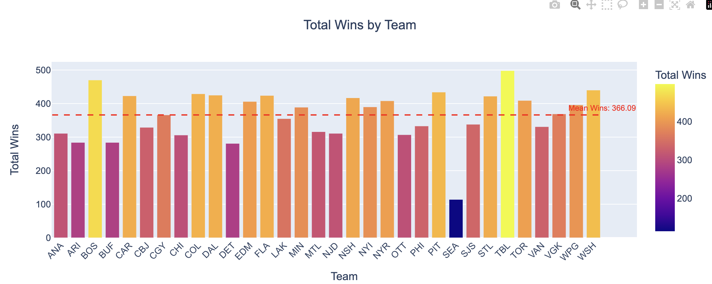
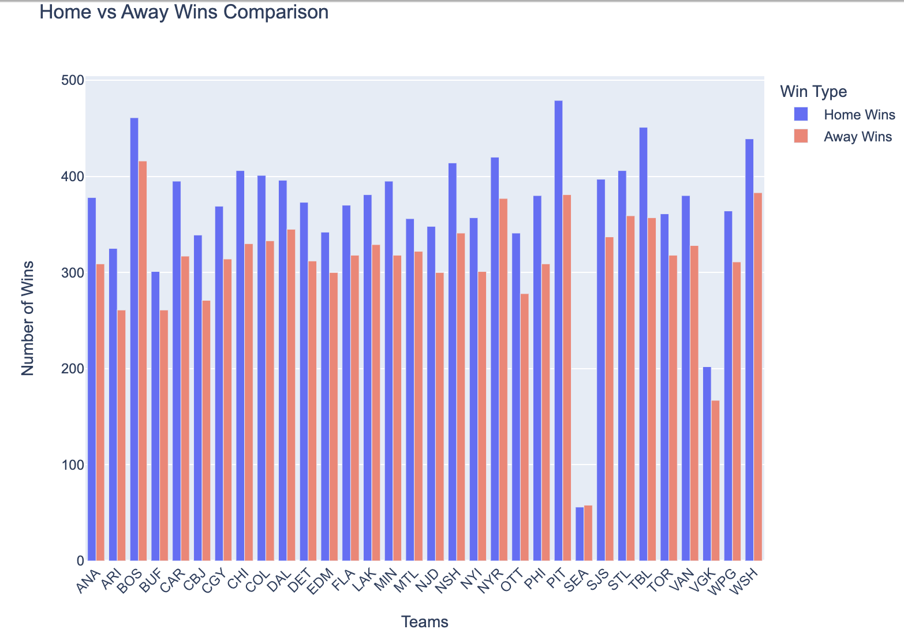
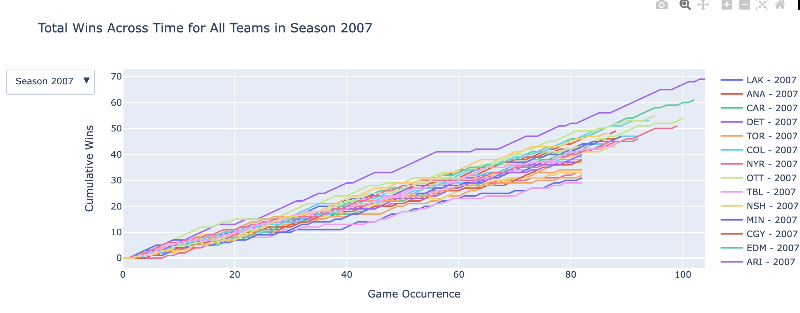
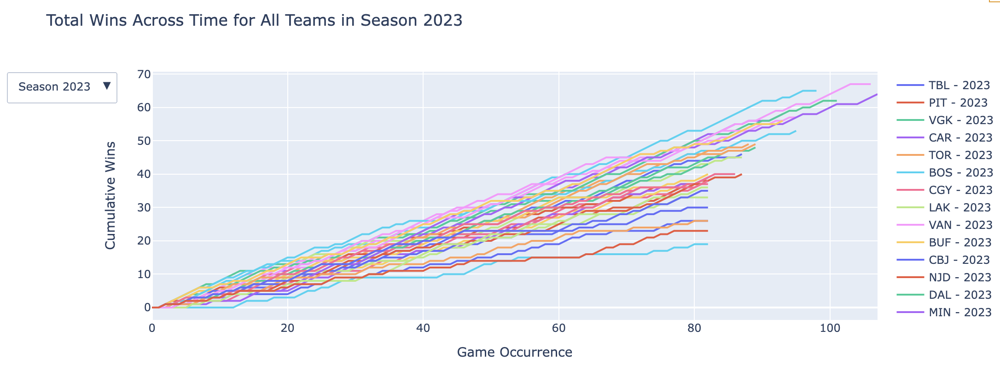
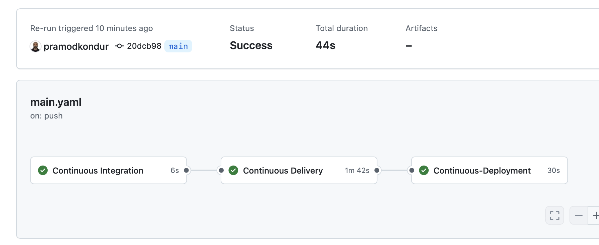

# NHL Betting Prediction Project

## Using Data from MoneyPuck (2007-2023) and Machine Learning for Smarter Wagering


Credits: [NHL Europe](https://www.google.com/url?sa=i&url=https%3A%2F%2Fwww.pinterest.com%2Fpin%2Folahraga--622622717258630186%2F&psig=AOvVaw1krLAPkLMDYKhaEOPpyvsn&ust=1727865732817000&source=images&cd=vfe&opi=89978449&ved=0CBQQjRxqFwoTCPjd_cz_7IgDFQAAAAAdAAAAABAW)

<a href="https://www.python.org/">
    
</a>
<a href="https://pandas.pydata.org/">
    
</a>
<a href="https://numpy.org/">
    
</a>
<a href="https://matplotlib.org/">
    
</a>
<a href="https://seaborn.pydata.org/">
    
</a>
<a href="#">
    
</a>
<a href="https://flask.palletsprojects.com/">
        
    </a>
    <a href="https://aws.amazon.com/">
        
    </a>
    <a href="https://aws.amazon.com/ec2/">
        
    </a>
    <a href="https://aws.amazon.com/elasticbeanstalk/">
        
    </a>
    <a href="https://www.docker.com/">
        
    </a>
    <a href="https://github.com/">
        
    </a>
    <a href="https://git-scm.com/">
        
    </a>
    <a href="https://docs.github.com/en/actions">
        
    </a>
    <a href="https://aws.amazon.com/ecr/">
        
    </a>
    <a href="#">
        
    </a>
    <a href="#">
        
    </a>
<a href="https://scikit-learn.org/stable/">
    
</a>

### Introduction
The National Hockey League (NHL) stands as one of the most popular sports leagues in North America, with a passionate fanbase extending across the globe. The intense speed, strategy, and unpredictability of hockey make it a thrilling sport for both fans and bettors. With the legalization and rise of sports betting in various regions, wagering on NHL games has become an exciting way for fans to engage with the sport.

However, NHL betting poses unique challenges due to factors like team dynamics, player form, injuries, and home-ice advantage. These elements can make predicting game outcomes difficult. 

---

### Motivation for the Project
The motivation behind this project stems from the intersection of data science and sports betting. Sports bettors often rely on subjective opinions or surface-level statistics, which can lead to inconsistent results. This project aims to provide a more robust, data-driven approach to predicting NHL game outcomes.

The volatility of the NHL, influenced by a variety of in-game and external factors, makes traditional predictions challenging. Machine learning can help bettors navigate this complexity by analyzing historical data and identifying patterns that humans might overlook. By leveraging advanced analytics, bettors can improve their chances of making more informed and profitable wagers.

---
# The Process 
  ### 1. Data Acquisition
### Money Puck - Dataset [Link](https://moneypuck.com/data.htm)

The dataset used for this project comes from MoneyPuck, an advanced hockey analytics site. It includes NHL game outcomes, player statistics, and team metrics from the 2007-2023 seasons. This rich dataset provides the foundation for making more accurate predictions using machine learning techniques.


Credits: [Douglas P. DeFelice Getty Images)](https://www.bardown.com/money-puck-releases-calculated-probabilities-for-each-nhl-team-s-fate-this-season-1.1570318)
  

#### Dataset Structure

The dataset contains 1840218 rows and 124 columns

The fields of the dataset are as follows:
```
    
shotID: Unique identifier for each shot -> (integer ID)

homeTeamCode: Code representing the home team -> (team code)

awayTeamCode: Code representing the away team -> (team code)

season: NHL season when the game took place -> (e.g., 2021-2022)

isPlayoffGame: Indicator if the game is a playoff game -> (True/False)

game_id: Unique identifier for the game -> (game ID)

homeTeamWon: Indicator if the home team won -> (True/False)

id: Generic event ID -> (integer ID)

time: Time of the event -> (time in seconds since the start of the game)

timeUntilNextEvent: Time until the next event occurs -> (seconds)

timeSinceLastEvent: Time since the previous event -> (seconds)

period: The period of the game -> (1, 2, 3, OT)

team: Team that performed the event -> (home team/away team)

location: Location of the event on the ice -> (coordinates or descriptive)

event: Type of event (e.g., shot, goal, block) -> (event type)

goal: Indicator if the event was a goal -> (True/False)

shotPlayContinuedOutsideZone: Whether play continued outside the zone after the 

shot -> (True/False)

shotPlayContinuedInZone: Whether play continued inside the zone after the shot -> (True/False)

shotGoalieFroze: Whether the goalie froze the puck after the shot -> (True/False)

shotPlayStopped: Whether play stopped after the shot -> (True/False)

shotGeneratedRebound: Whether the shot generated a rebound -> (True/False)

homeTeamGoals: Number of goals scored by the home team -> (integer count)

awayTeamGoals: Number of goals scored by the away team -> (integer count)

xCord: X-coordinate of the event -> (coordinate value)

yCord: Y-coordinate of the event -> (coordinate value)

xCordAdjusted: Adjusted X-coordinate for arena size -> (adjusted value)

yCordAdjusted: Adjusted Y-coordinate for arena size -> (adjusted value)

shotAngle: The angle of the shot relative to the net -> (degrees)

shotAngleAdjusted: Adjusted shot angle for arena size -> (degrees)

shotAnglePlusRebound: Combined shot angle and rebound angle -> (degrees)

shotAngleReboundRoyalRoad: Shot angle after a rebound across the "Royal Road" 

(center of ice) -> (degrees)

shotDistance: Distance from where the shot was taken to the net -> (feet)

shotType: Type of shot taken -> (e.g., slap shot, wrist shot)

shotOnEmptyNet: Whether the shot was on an empty net -> (True/False)

shotRebound: Indicator if the shot was a rebound -> (True/False)

shotAnglePlusReboundSpeed: Speed of the shot combined with rebound angle -> (speed value)

shotRush: Whether the shot was taken during a rush -> (True/False)

speedFromLastEvent: Speed from the previous event to this shot -> (speed in feet/second)

lastEventxCord: X-coordinate of the previous event -> (coordinate value)

lastEventyCord: Y-coordinate of the previous event -> (coordinate value)

distanceFromLastEvent: Distance from the last event to the current one -> (feet)

lastEventShotAngle: Shot angle from the last event -> (degrees)

lastEventShotDistance: Shot distance from the last event -> (feet)

lastEventCategory: Category of the previous event -> (event category, e.g., pass, 
block)

lastEventTeam: Team that performed the previous event -> (home team/away team)

homeEmptyNet: Indicator if the home team’s net is empty -> (True/False)

awayEmptyNet: Indicator if the away team’s net is empty -> (True/False)

homeSkatersOnIce: Number of skaters on the ice for the home team -> (integer count)

awaySkatersOnIce: Number of skaters on the ice for the away team -> (integer count)

awayPenalty1TimeLeft: Time left on the first penalty for the away team -> (seconds)

awayPenalty1Length: Length of the first penalty for the away team -> (seconds)

homePenalty1TimeLeft: Time left on the first penalty for the home team -> (seconds)

homePenalty1Length: Length of the first penalty for the home team -> (seconds)

playerPositionThatDidEvent: Position of the player that performed the event -> (e.g., forward, defenseman)

playerNumThatDidEvent: Jersey number of the player that performed the event -> (integer)

playerNumThatDidLastEvent: Jersey number of the player that performed the previous event -> (integer)

lastEventxCord_adjusted: Adjusted X-coordinate of the previous event for arena size -> (adjusted value)

lastEventyCord_adjusted: Adjusted Y-coordinate of the previous event for arena size -> (adjusted value)

timeSinceFaceoff: Time since the last faceoff occurred -> (seconds)

goalieIdForShot: Unique identifier of the goalie for the shot -> (goalie ID)

goalieNameForShot: Name of the goalie for the shot -> (goalie name)

shooterPlayerId: Unique identifier of the shooter -> (player ID)

shooterName: Name of the shooter -> (player name)

shooterLeftRight: Shooter’s handedness (left or right) -> (Left/Right)

shooterTimeOnIce: Time the shooter has been on the ice -> (seconds)

shooterTimeOnIceSinceFaceoff: Shooter's time on ice since the last faceoff -> (seconds)

shootingTeamForwardsOnIce: Number of forwards on the ice for the shooting team -> (integer count)

shootingTeamDefencemenOnIce: Number of defensemen on the ice for the shooting team -> (integer count)

shootingTeamAverageTimeOnIce: Average time on ice for the shooting team -> (seconds)

shootingTeamAverageTimeOnIceOfForwards: Average time on ice for the forwards of the shooting team -> (seconds)

shootingTeamAverageTimeOnIceOfDefencemen: Average time on ice for the defensemen of the shooting team -> (seconds)

shootingTeamMaxTimeOnIce: Maximum time on ice for the shooting team -> (seconds)

shootingTeamMaxTimeOnIceOfForwards: Maximum time on ice for forwards of the shooting team -> (seconds)

shootingTeamMaxTimeOnIceOfDefencemen: Maximum time on ice for defensemen of the shooting team -> (seconds)

shootingTeamMinTimeOnIce: Minimum time on ice for the shooting team -> (seconds)

shootingTeamMinTimeOnIceOfForwards: Minimum time on ice for forwards of the shooting team -> (seconds)

shootingTeamMinTimeOnIceOfDefencemen: Minimum time on ice for defensemen of the shooting team -> (seconds)

shootingTeamAverageTimeOnIceSinceFaceoff: Average time on ice since faceoff for the shooting team -> (seconds)

defendingTeamForwardsOnIce: Number of forwards on the ice for the defending team -> (integer count)

defendingTeamDefencemenOnIce: Number of defensemen on the ice for the defending team -> (integer count)

defendingTeamAverageTimeOnIce: Average time on ice for the defending team -> (seconds)

arenaAdjustedShotDistance: Shot distance adjusted for the arena size -> (feet)

arenaAdjustedXCord: Adjusted X-coordinate for arena -> (coordinate value)

arenaAdjustedYCord: Adjusted Y-coordinate for arena -> (coordinate value)

offWing: Indicator if the shot was taken from the off-wing -> (True/False)

xGoal: Expected goal probability -> (value between 0 and 1)

xRebound: Expected probability of a rebound -> (value between 0 and 1)

shotWasOnGoal: Indicator if the shot was on goal -> (True/False)
```

---
## 2. Data Preprocessing and Preparation
 This step contains various steps in order to utlize our data for our modelling. 
 They are as follows:

- Check for null values
- Remove duplicate values as we don't necessarily want all the events of a game such as shot, miss etc.
- Replacing team name discrepancies such as N.J, T.B etc. mentioned as well NJD, TBF etc.,as well as ATL which were relocated to winnepeg after 2011 and became Winnepeg Jets.

```
duplicate_mapping = {
    'S.J': 'SJS',   # San Jose Sharks
    'N.J': 'NJD',   # New Jersey Devils
    'T.B': 'TBL',   # Tampa Bay Lightning
    'L.A': 'LAK'    # Los Angeles Kings
}

# Replace duplicates in 'awayTeamCode' and 'homeTeamCode' columns
df['awayTeamCode'] = df['awayTeamCode'].replace(duplicate_mapping)
df['homeTeamCode'] = df['homeTeamCode'].replace(duplicate_mapping)
# Replace ATL
df['homeTeamCode'] = df['homeTeamCode'].replace('ATL', 'WPG')
df['awayTeamCode'] = df['awayTeamCode'].replace('ATL', 'WPG')
```

## 3. Adding various new features/columns:

In this step we create new features which would assist us while modelling.

We add features such as 

- 'total_games_played_by_home' - total number of games played by the home team so far

- 'total_games_played_by_away' - total number of games played by the away team so far

- 'total_wins_home' - total wins by the current home team so far

- 'total_losses_home' - total losses by the current home team so far 

- 'total_wins_away' - total wins by the current away team so far

- 'total_losses_away' - total losses by the current awawy team so far

```
# Sort the DataFrame by season and game_id
df = df.sort_values(by=['season', 'game_id']).reset_index(drop=True)

# Initialize columns for total games, wins, and losses
df['total_games_played_by_home'] = 0
df['total_games_played_by_away'] = 0
df['total_wins_home'] = 0
df['total_losses_home'] = 0
df['total_wins_away'] = 0
df['total_losses_away'] = 0

# Use dictionaries to store cumulative counts
team_games_count = {}
team_wins_count = {}

# Variable to keep track of the last season processed
last_season = None

# Iterate through each row to calculate totals
for index, row in df.iterrows():
    # Get team codes and season
    home_team = row['homeTeamCode']
    away_team = row['awayTeamCode']
    season = row['season']

    # Reset the dictionaries if the season has changed
    if last_season != season:
        team_games_count = {}
        team_wins_count = {}
        last_season = season

    # Initialize if not present for home team
    if home_team not in team_games_count:
        team_games_count[home_team] = {'total': 0, 'wins': 0}
    if away_team not in team_games_count:
        team_games_count[away_team] = {'total': 0, 'wins': 0}

    # Update current row with previous totals
    df.at[index, 'total_games_played_by_home'] = team_games_count[home_team]['total']
    df.at[index, 'total_games_played_by_away'] = team_games_count[away_team]['total']
    df.at[index, 'total_wins_home'] = team_wins_count.get(home_team, 0)
    df.at[index, 'total_losses_home'] = df.at[index, 'total_games_played_by_home'] - df.at[index, 'total_wins_home']
    df.at[index, 'total_wins_away'] = team_wins_count.get(away_team, 0)
    df.at[index, 'total_losses_away'] = df.at[index, 'total_games_played_by_away'] - df.at[index, 'total_wins_away']

    # Update counts for the home team
    team_games_count[home_team]['total'] += 1
    if row['homeTeamWon'] == 1:
        team_wins_count[home_team] = team_wins_count.get(home_team, 0) + 1

    # Update counts for the away team
    team_games_count[away_team]['total'] += 1
    if row['homeTeamWon'] == 0:
        team_wins_count[away_team] = team_wins_count.get(away_team, 0) + 1

```

- 'last_10_games_wins_home' - last 10 games win count for current home team

- 'last_10_games_wins_away' - last 10 games win count for current away team'


```
def calculate_last_10_games_wins(df, team_code, game_id, season, max_n=10):
    # Filter for all previous games in the current season
    previous_games = df[(df['season'] == season) & (df['game_id'] < game_id)]
    
    # Filter games where the team is either home or away
    team_games = previous_games[(previous_games['homeTeamCode'] == team_code) | 
                                (previous_games['awayTeamCode'] == team_code)]
    
    # Sort by game_id to ensure proper game order
    team_games = team_games.sort_values(by='game_id')
    
    # Select the last n games (maximum max_n)
    last_n_games = team_games.tail(max_n)
    
    # If there are no games available, return 0
    if last_n_games.empty:
        return 0
    
    # Calculate the total wins in the last n games
    total_wins = 0
    for _, game in last_n_games.iterrows():
        if game['homeTeamCode'] == team_code:
            total_wins += game['homeTeamWon']  # Home win is 1 if they won
        else:
            total_wins += (1 - game['homeTeamWon'])  # Away win is 1 if home team lost
    
    return total_wins

# Apply this function for every row to calculate cumulative total wins for both home and away teams
def add_last_10_games_win_columns(df, max_n=10):
    df['last_10_games_win_home'] = 0
    df['last_10_games_win_away'] = 0
    
    for idx, row in df.iterrows():
        game_id = row['game_id']
        season = row['season']
        home_team = row['homeTeamCode']
        away_team = row['awayTeamCode']
        
        # Calculate cumulative wins for home team
        cumulative_wins_home = calculate_last_10_games_wins(df, home_team, game_id, season, max_n)
        
        # Calculate cumulative wins for away team
        cumulative_wins_away = calculate_last_10_games_wins(df, away_team, game_id, season, max_n)
        
        # Assign cumulative wins to the new columns
        df.at[idx, 'last_10_games_win_home'] = cumulative_wins_home
        df.at[idx, 'last_10_games_win_away'] = cumulative_wins_away
    
    return df

df = add_last_10_games_win_columns(df)

```

- 'last_meeting_result_home' = last meeting result for current home team 

- 'last_meeting_result_away' = last meeting result for current away team 

- 'last_game_result_home' = last game result for current home team

- 'last_game_result_away' = last game result for current away team

```
# Helper function to get last meeting result till the current row (with season check)
def get_last_meeting_result(team1, team2, current_game_id, current_season):
    last_meeting = df[((df['homeTeamCode'] == team1) & (df['awayTeamCode'] == team2)) |
                      ((df['homeTeamCode'] == team2) & (df['awayTeamCode'] == team1)) &
                      (df['game_id'] < current_game_id) &
                      (df['season'] == current_season)]  # Ensure same season and before the current game
    last_meeting = last_meeting.tail(1)
    
    return last_meeting['homeTeamWon'].values[0] if not last_meeting.empty else None

# Helper function to get last game result (home or away) till the current row (with season check)
def get_last_game_result(team_code, current_game_id, current_season):
    last_game = df[((df['homeTeamCode'] == team_code) | (df['awayTeamCode'] == team_code)) &
                   (df['game_id'] < current_game_id) &
                   (df['season'] == current_season)]  # Ensure same season and before the current game
    last_game = last_game.tail(1)
    
    if last_game.empty:
        return None
    return last_game['homeTeamWon'].values[0] if last_game['homeTeamCode'].values[0] == team_code else 1 - last_game['homeTeamWon'].values[0]

df['last_meeting_result'] = df.apply(lambda row: get_last_meeting_result(row['homeTeamCode'], row['awayTeamCode'], row['game_id'], row['season']), axis=1)
df['last_game_result_home'] = df.apply(lambda row: get_last_game_result(row['homeTeamCode'], row['game_id'], row['season']), axis=1)
df['last_game_result_away'] = df.apply(lambda row: get_last_game_result(row['awayTeamCode'], row['game_id'], row['season']), axis=1)
```

All of these will be useful fo our prediction

## 4. EDA (Exploratory Data Analysis)

In this we will try to look at an overall view of how the teams data looks


Noticebaly there is less score for SEA(Seattle Kraken) as they were only formed in 2021





Here are several conclusions that we can draw from our exploratory data analysis (EDA):

- Home vs. Away Performance:

There are notable variations in win probabilities between home and away games, suggesting that the venue of a match significantly impacts team performance. Teams tend to perform better at home, emphasizing the importance of incorporating features that distinguish between home and away games in predictive models.
Team Performance Disparities:

The total wins recorded across different teams reveal significant disparities in performance levels. Some teams consistently outperform others, indicating that certain franchises may have stronger rosters, better coaching strategies, or more effective training programs. This information could guide decisions related to team development and resource allocation.

- Win Progression Over Time:

The analysis of win progression over time shows distinct trends for each team throughout the seasons. Certain teams display sustained success, while others struggle to maintain consistency. This trend analysis can help identify patterns in performance, enabling teams to understand periods of strength and weakness and informing future strategic decisions.

- Insights into Team Dynamics:

By examining win statistics in relation to various factors (e.g., opponent strength, player injuries, or changes in coaching staff), we can derive deeper insights into the dynamics of each team. This understanding could inform decisions on player acquisitions, trades, or changes in coaching staff to enhance overall team performance.

- Fan Engagement and Marketing Strategies:

Understanding how different teams perform in various contexts can help franchises tailor their marketing strategies and fan engagement initiatives. For instance, highlighting a team’s strong home performance could drive ticket sales, while strategies could be developed to boost support during away games.

- Seasonal Trends:

Insights gained from analyzing performance trends across seasons can guide teams in assessing their long-term strategies. Recognizing when a team tends to perform best or struggles may assist in optimizing training schedules, scouting efforts, and overall resource management.

- Predictive Modeling Opportunities: (OUR MAIN FOCUS HERE)

The variations in team performance and the impact of game location present opportunities for developing predictive models that can forecast outcomes based on historical performance data. Incorporating factors such as home/away status, total wins, and win progression could improve the accuracy of predictions and aid in strategic planning.

Overall, these conclusions can help inform strategic decisions for team management, fan engagement, and predictive modeling while emphasizing the importance of continuous performance analysis in sports analytics.

## 5. Model Training, Testing and Evaluation

In this step, we will look to train,test, and evaluate our model. The dataset is split into train and test and evaluated first on a base Random Forest Model without all the new features and then further 3 models with the new features and the results are as so:
- A baseline model achieved an F1 score of **55%**, giving a basic measure of predictive performance.
- An enhanced model which was a fine tuned Random Forest model achieved an F1 score of **71%**, demonstrating significant improvement.


## 6. Flask Application

The project utilizes Flask to create a web application that enables users to interact with the predictive model seamlessly. Flask, being a lightweight WSGI web application framework in Python, is ideal for this project due to its simplicity and flexibility.

### Key Features of the Flask Application:
- **User Input**: Users can enter details such as team names and game data to receive predictions about game outcomes.
- **Real-Time Predictions**: The application processes user input in real-time, providing immediate feedback based on the trained machine learning model.
- **API Endpoints**: The Flask app exposes RESTful API endpoints that facilitate communication between the front-end and back-end components, allowing for easy integration and scalability.
- **Deployment Ready**: The application is designed to be easily deployable on cloud platforms like AWS, ensuring accessibility and scalability.

The Flask application serves as the interface for users to interact with the predictive model, making it an essential part of the overall architecture of the project.

## 7. Including Modular Approach

### Importance of Modular Coding in Machine Learning

A modular approach to coding involves breaking down a program into distinct, manageable components or modules, each of which handles a specific part of the functionality. This is particularly important in machine learning for several reasons:

- **Reusability**: Modules can be reused across different projects or different parts of the same project. This reduces redundancy and speeds up the development process.
- **Maintainability**: Modular code is easier to read, understand, and maintain. Changes or updates can be made to specific modules without affecting the entire codebase.
- **Collaboration**: In team environments, modular coding allows multiple developers to work on different components simultaneously, improving productivity and reducing conflicts.
- **Testing**: Each module can be independently tested, making it easier to identify and fix bugs. This enhances the reliability of the machine learning pipeline.

### Structure and Components of the Modular Approach

The structure of a modular machine learning project typically includes the following components:

1. **Data Ingestion Module**: This module handles the retrieval and loading of datasets, such as downloading data from MoneyPuck or other sources, and ensures that the data is in the right format for processing.

2. **Data Preprocessing Module**: This component includes functions for cleaning and preparing the data for analysis. This can involve handling missing values, normalizing data, feature extraction, and more.

3. **Feature Engineering Module**: In this module, features are created and transformed from raw data. This includes calculating statistics like goal differentials and other relevant metrics that improve model accuracy.

4. **Model Training Module**: This part contains the code for training machine learning models. Different algorithms can be tested here, and hyperparameter tuning can be performed to optimize performance.

5. **Model Evaluation Module**: After training, models need to be evaluated. This module includes code for assessing the model's performance using metrics such as F1 score, accuracy, precision, and recall.

6. **Prediction Module**: This module is responsible for making predictions based on the trained model and user input. It handles input validation and formats the output for user-friendly presentation.

7. **Deployment Module**: This final module focuses on deploying the application, ensuring that it runs smoothly in production environments, such as AWS EC2 and Elastic Beanstalk.

### Loggers and Exception Handling

To enhance the robustness of the application, logging and exception handling were implemented in the modular code as well.

### Pipelines

Each of these modules can now be integrated into a cohesive pipeline that automates the workflow from data ingestion to deployment. The pipelines ensure that data flows seamlessly through the various stages, allowing for efficient and reproducible machine learning processes. This structure not only enhances clarity but also provides a framework for continuous improvement and updates as new data or methods become available.

By employing a modular approach, we can ensure that the project achieves a clean, efficient, and scalable codebase that can adapt to changing requirements and facilitate ongoing development.

## 8. Deployment and Application

The application underwent a comprehensive deployment process to ensure that it was accessible, scalable, and maintainable:

- **AWS EC2 and Elastic Beanstalk** were used to host and scale the application, ensuring it could handle traffic and process requests efficiently.
- **Docker and Amazon ECR** facilitated easy deployment and scaling of the web app in different environments, maintaining consistency regardless of where the application was running.
- **CI/CD Pipelines** automated the deployment process. Any changes to the codebase, whether fixing bugs or updating features, were automatically tested, integrated, and deployed to production, ensuring a seamless user experience.
  - **GitHub Actions** played a crucial role in this CI/CD pipeline, allowing for automated workflows that handle building, testing, and deploying the application. 
  - **GitHub Runners** provided the environment where the workflows execute, ensuring that the deployment process runs efficiently and reliably.

Image of the required keys needed for running the project successfully which can be setup in AWS


Image of the CI/CD on Github Actions:



This deployment strategy not only enhances the application's performance but also ensures that updates are delivered to users quickly and without interruption.

Images for the app deployed on AWS EC2


# 9. Hypothetical Gain from the model

This project created a predictive model for NHL games, analyzing the potential financial gains from betting based on predicted outcomes. The model achieves an accuracy of **71%**, enabling users to make informed betting decisions throughout an NHL season. Now let's see how it would work in real use case.

## Model Assumptions

- **Total Games in a Season**: Approximately **656 games**.
- **Predicted Wins**: With a **71%** accuracy:
  Predicted Wins = 0.71 * 656 ≈ 462 wins

## Hypothetical Betting Example

Let’s assume our model predicts the winning team for each game based on its analysis. We will consider a mix of different teams across hypothetical matchups throughout the season.

### Betting Strategy

- **Bet $100** on the predicted winning team in each matchup.

### Expected Winnings Calculation

1. **Winning Teams and Odds**: For simplicity, we assume the following moneyline odds for various hypothetical teams:
   - **Favorites (approx. 60% of predicted wins)**: Average odds of -130
   - **Underdogs (approx. 40% of predicted wins)**: Average odds of +150

#### Breakdown of Bets

- **Number of Bets on Favorites**:
Bets on Favorites = 0.6 * 462 ≈ 277 wins


- **Number of Bets on Underdogs**:
Bets on Underdogs = 0.4 * 462 ≈ 185 wins

- **Losses (Incorrect Predictions)**:

Losses = 0.29 × 462 = 133.98 ≈ 134 games


### Total Payout Calculation

1. **For Favorites (Odds -130)**:
   - **Profit Calculation**:
  Profit per Bet = 100 * (100 / 130) ≈ 76.92


   - **Total Profit**:
  Total Profit from Favorites = 277 * 76.92 ≈ 21,358.84


2. **For Underdogs (Odds +150)**:
   - **Profit Calculation**:
Profit per Bet = 100 * (150 / 100) = 150

   - **Total Profit**:
Total Profit from Underdogs = 185 * 150 = 27,750

3. **For Losses**:
Total Loss from Incorrect Predictions = 134 * 100 = 13,400


### Total Estimated Profit for the Season

Total Estimated Profit = 21,358.84 + 27,750 - 13,400 ≈ 35,708.84

The adjusted total estimated profit for an entire season of NHL hockey games amounts to **$35,708.84**. This figure indicates a promising return on investment, showcasing the potential profitability of employing a strategic betting approach based on model predictions.

## 10. Conclusion
This project effectively showcased the integration of data science and machine learning to enhance predictions of NHL game outcomes. By leveraging data from MoneyPuck, applying advanced machine learning algorithms, and utilizing modern deployment technologies, we developed a model that substantially increased prediction accuracy.

Employing a modular coding approach, a containerized architecture with Docker, and streamlined CI/CD pipelines, the project was successfully deployed and maintained on AWS EC2 and Elastic Beanstalk. This robust setup empowers bettors with a valuable tool for making well-informed decisions, ultimately enhancing their profitability and enjoyment of NHL betting.

Looking ahead, there are numerous opportunities for improvement, including refining the model’s accuracy, enhancing the user interface, expanding the application to encompass more game-related features, and integrating live in-game data for real-time betting insights. With a solid foundation established by this project, the potential for future enhancements is promising.

Credits: [NHL](https://www.nhl.com/) and [Money Puck](https://moneypuck.com/data.htm)

## Disclaimer

**Responsible Betting**: Please remember that sports betting should be done responsibly. Always gamble within your means and be aware of the risks involved. Betting outcomes can be unpredictable, and it's crucial to manage your bankroll wisely. If you feel that your gambling habits are becoming problematic, consider seeking assistance from a professional or a support group.